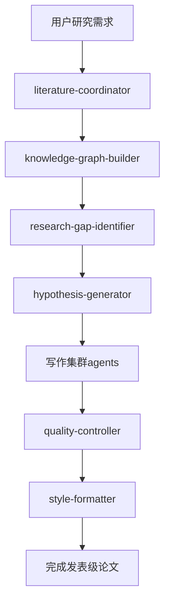

# Claude Code集成指南

本文档详细说明如何在Claude Code环境中使用新的AI4Research subagent系统。

## 🎯 系统集成概览

### Claude Code Subagent架构
```
Claude Code Environment
├── .claude/agents/           # Claude原生subagent目录
│   ├── academic-researcher.md    # MCP集成学术研究agent
│   ├── research/                 # 5个研究发现agents
│   ├── writing/                  # 5个写作集群agents  
│   ├── infrastructure/           # 3个基础设施agents
│   └── integration/              # 1个集成agent
├── scripts/cache/               # 智能缓存系统
├── tests/                       # 测试和演示
└── Reference/                   # 文档和存档
```

### MCP (Model Context Protocol) 集成
```yaml
mcp_integration:
  existing_agent: "academic-researcher"
  integration_mode: "协调增强"
  data_flow: "MCP结果 → literature-coordinator → 语义增强"
  compatibility: "完全兼容，无冲突"
```

## 🚀 在Claude Code中的使用方法

### 1. 基础调用语法
在Claude Code环境中，使用标准的`/agent`命令调用subagents：

```bash
# 研究发现类
/agent literature-coordinator: "搜索[研究主题]的最新文献"
/agent knowledge-graph-builder: "构建[领域]的知识图谱"
/agent hypothesis-generator: "生成[方向]的研究假设"
/agent trend-analyzer: "分析[领域]研究趋势"
/agent research-gap-identifier: "识别[领域]研究空白"

# 写作集群类 (带参数)
/agent intro-cluster --task background: "构建[主题]背景重要性"
/agent method-cluster --task algorithm: "详述[算法]实现细节"
/agent results-cluster --task comparison: "对比[方法]性能差异"
/agent discussion-cluster --task impact: "评估[研究]科学影响"
/agent format-cluster --task abstract: "优化论文摘要"

# 基础设施类
/agent cache-manager: "搜索相似研究或优化缓存"
/agent quality-controller: "执行四重质量门控验证"
/agent style-formatter: "应用[期刊]格式要求"

# 集成类
/agent semantic-scholar-api: "搜索Semantic Scholar数据库"
```

### 2. 与Claude Code工作流集成

#### 标准研究工作流


#### Claude Code特定优化
```bash
# 利用Claude Code的文件系统
/agent literature-coordinator: "分析项目目录中的Paper.md，补充相关文献"

# 与版本控制集成
/agent quality-controller: "检查当前提交版本的论文质量"

# 与编辑器集成
/agent format-cluster --task language: "润色当前打开的论文稿件"
```

## 🔧 高级集成特性

### 1. 缓存系统集成
```bash
# 缓存系统在Claude Code环境中的使用
python src/scripts/cache/cache_query.py search --query "neural networks"

# 通过agent调用缓存
/agent cache-manager: "找到与当前研究相似的历史会话"

# 自动缓存Claude思考过程
# (后台自动运行，无需手动操作)
```

### 2. MCP Agent协调
```yaml
coordination_pattern:
  step_1: "用户发起文献搜索请求"
  step_2: "literature-coordinator调用MCP academic-researcher"
  step_3: "获取基础搜索结果"
  step_4: "literature-coordinator增强处理"
  step_5: "返回综合分析结果"

example_flow:
  user_request: "搜索量子机器学习论文"
  mcp_call: "academic-researcher执行基础搜索"
  enhancement: "语义搜索扩展到125M+论文"
  synthesis: "生成证据综合报告"
```

### 3. 智能工作流推荐
```bash
# Claude Code环境感知
/agent cache-manager: "基于当前项目结构推荐最佳工作流"

# 个性化建议
/agent cache-manager: "分析我的研究习惯并优化流程"

# 协作优化
/agent cache-manager: "识别团队协作中的效率瓶颈"
```

## 🎯 实际使用场景

### 场景1: 新研究项目启动
```bash
# Step 1: 项目初始化
cd /path/to/new-research-project
cp -r Reference/claude-code-paper-master-template/* ./

# Step 2: 文献调研
/agent literature-coordinator: "全面搜索[研究主题]相关文献"

# Step 3: 知识结构分析
/agent knowledge-graph-builder: "构建研究领域知识图谱"

# Step 4: 研究方向确定
/agent research-gap-identifier: "识别最有价值的研究空白"
/agent hypothesis-generator: "生成可验证的研究假设"

# Step 5: 项目规划
/agent trend-analyzer: "分析研究时机和竞争态势"
```

### 场景2: 论文写作加速
```bash
# 基于模板和缓存加速写作
/agent cache-manager: "查找相似论文的成功写作模式"

# 分节并行写作
/agent intro-cluster --task background: "构建研究背景" &
/agent method-cluster --task overview: "设计方法架构" &
/agent results-cluster --task experiment: "规划实验设计" &
wait

# 质量控制迭代
/agent quality-controller: "执行质量检查"
# 根据反馈进行迭代修改
/agent format-cluster --task language: "根据质量反馈润色语言"
```

### 场景3: 多期刊投稿
```bash
# Nature投稿版本
/agent style-formatter: "格式化为Nature Machine Intelligence格式"
/agent format-cluster --task abstract: "创建150-200词Nature摘要"

# Science投稿版本  
/agent style-formatter: "转换为Science期刊格式"
/agent format-cluster --task abstract: "创建125词Science摘要"

# 计算机会议版本
/agent style-formatter: "适配NeurIPS会议格式"
/agent format-cluster --task structure: "调整为会议论文结构"
```

## 📊 性能监控与优化

### 1. 使用统计监控
```bash
# 查看agent使用统计
/agent cache-manager: "显示各agent的使用频率和成功率"

# 性能瓶颈分析
/agent cache-manager: "识别工作流中的时间瓶颈"

# 效率优化建议
/agent cache-manager: "基于使用模式推荐优化策略"
```

### 2. 质量趋势跟踪
```bash
# 论文质量趋势
/agent quality-controller: "分析历史论文质量评分趋势"

# 改进建议跟踪
/agent cache-manager: "追踪质量改进建议的实施效果"
```

## 🔐 安全和隐私考虑

### 1. 数据安全
- 所有缓存数据存储在本地`dev/cache/`目录
- 支持加密敏感研究数据
- 提供数据清理和匿名化选项

### 2. 隐私保护
```bash
# 敏感数据处理
/agent cache-manager: "设置私密研究项目的缓存策略"

# 数据共享控制
/agent cache-manager: "配置团队缓存共享权限"
```

### 3. 访问控制
```yaml
access_control:
  personal_cache: "仅限个人访问"
  team_cache: "团队成员共享"
  public_cache: "公开可访问的general insights"
```

## 🛠️ 故障排除和维护

### 常见问题解决
```bash
# Agent响应异常
/agent cache-manager: "检查agent系统健康状态"

# 缓存系统问题
# Cache system check commands are now available through:

# 清理和重置
/agent cache-manager: "执行系统清理和优化"
```

### 系统维护
```bash
# 定期维护脚本
python src/scripts/cache/cache_query.py stats

# 性能优化
/agent cache-manager: "执行定期性能优化"

# 备份和恢复
cp -r dev/cache/ backup/cache-$(date +%Y%m%d)/
```

## 📈 集成效果评估

### 预期性能指标
- **研究效率提升**: 70-80%
- **论文质量**: Nature级别 (8.5+ /10分)
- **工作流简化**: 59%命令减少 (34→14 agents)
- **学习曲线**: 2-3天掌握核心功能

### 成功案例模式
```bash
# 查看成功案例
/agent cache-manager: "展示最成功的研究项目案例"

# 最佳实践提取
/agent cache-manager: "提取高效工作流的共同特征"
```

## 🔮 未来扩展规划

### 1. 增强集成
- 与更多MCP agents集成
- 支持外部工具API集成
- 增强跨平台兼容性

### 2. 智能化提升
- 机器学习驱动的工作流推荐
- 自适应质量标准
- 预测性研究趋势分析

### 3. 协作强化
- 实时协作缓存同步
- 分布式研究团队支持
- 跨机构知识共享

---

*通过这个集成系统，Claude Code用户将获得前所未有的AI4Research能力，实现从想法到发表的全流程智能化支持！*